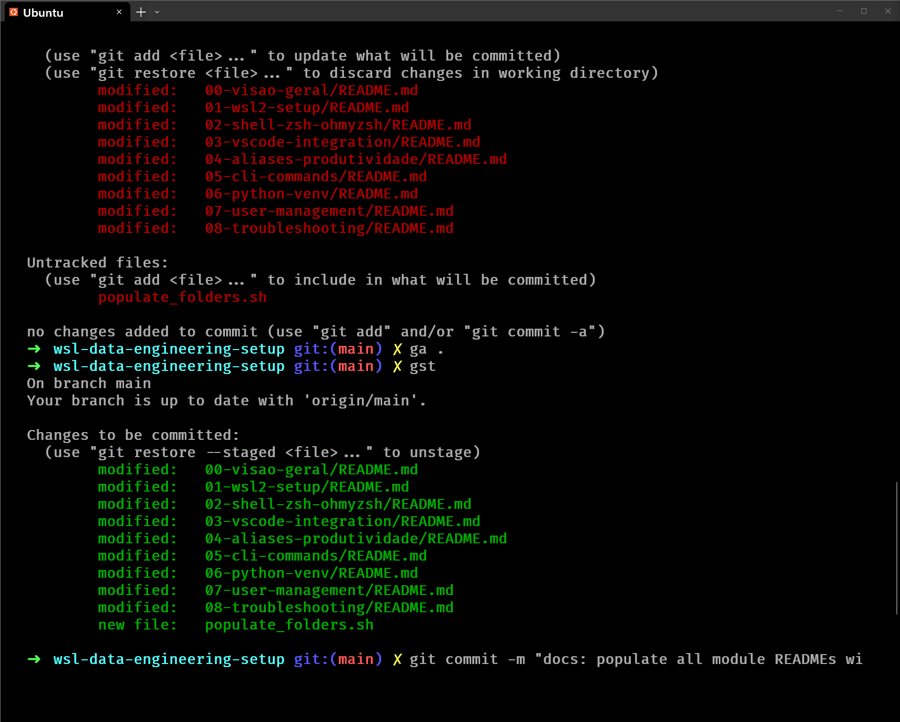
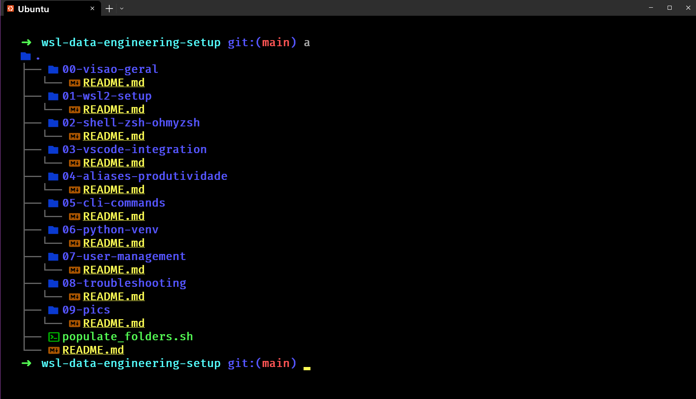
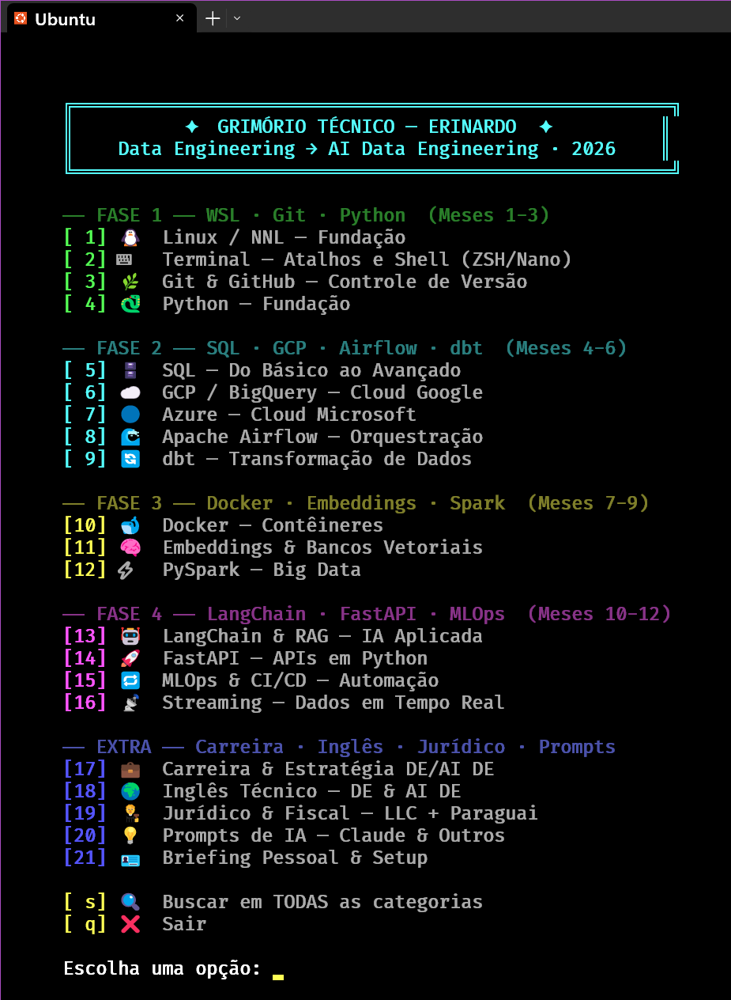
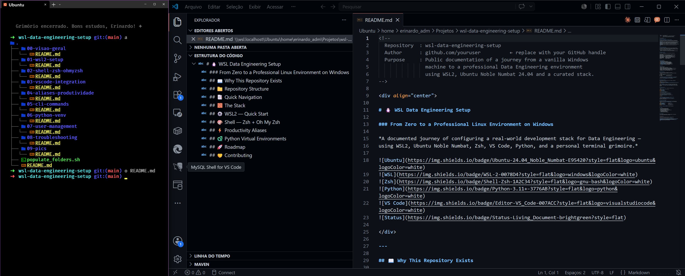
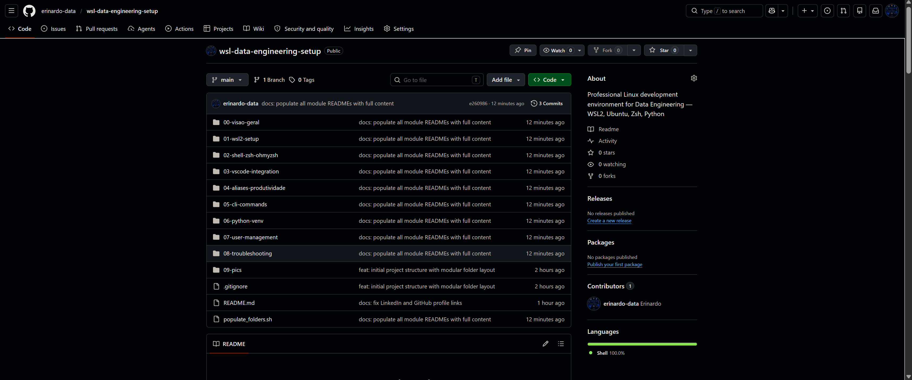

# 09 — Terminal Screenshots
> A visual record of the environment at each stage of the setup.

---

## 🖼️ 01 — Zsh Prompt

The configured Zsh shell with the `robbyrussell` theme.
The `➜` prompt with directory highlighting confirms Oh My Zsh is active and the Fira Code Nerd Font is rendering correctly.

---

## 🖼️ 02 — Project Tree Structure

The `a` alias (`eza --icons --tree`) rendering the modular folder structure of the repository.
Each icon is provided by the Nerd Font — a sign that the font and `eza` are properly configured.

---

## 🖼️ 03 — Grimoire Panel

The personal grimoire — a Python-powered interactive reference panel.
Launched with the `g` alias, it serves as a quick-access cheatsheet for the most-used commands and aliases.

---

## 🖼️ 04 — VS Code + WSL Integration

VS Code connected to the WSL Linux filesystem via the official WSL extension.
The `WSL: Ubuntu` indicator in the bottom-left corner confirms native Linux file editing from Windows.

---

## 🖼️ 05 — GitHub Repository

The live repository on GitHub with the rendered README,
clickable badges, and the modular folder structure visible in the file explorer.

---

*Back to: [Project Overview](../README.md)*
